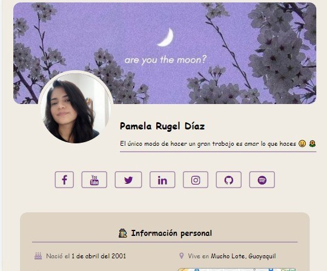
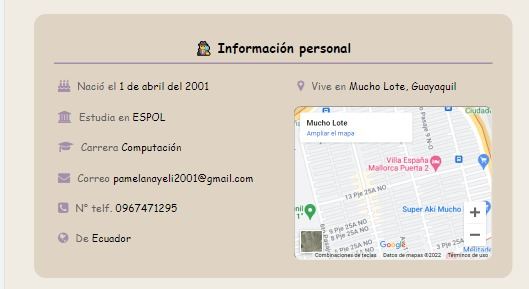
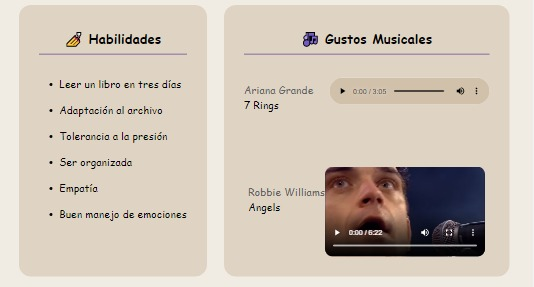
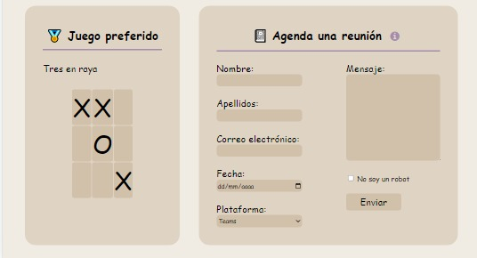
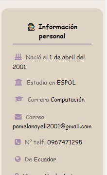
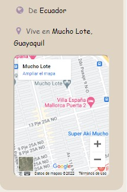
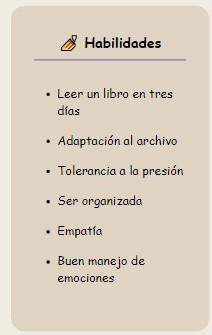
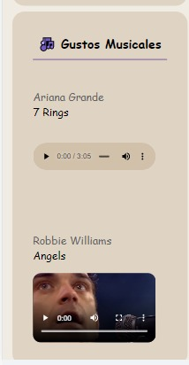
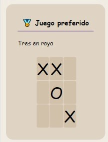
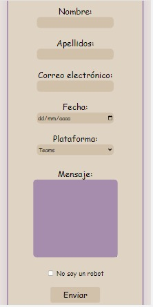

# Proyecto1
Portafolio con proyecto realizado en la materia de Desarrollo de Aplicaciones Web y Móviles (DAWM)

## Implementación y diseño de una página web en html con hojas de estilo en cascada.

* Página en Escritorio.

* Página en dispositivo móvil

 
 
 
 
 
 